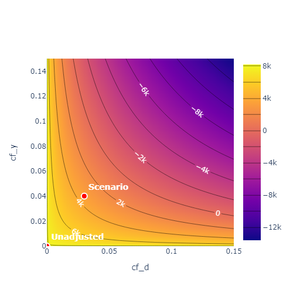

.. _sensitivity:

Sensitivity analysis
------------------------

The :ref:`DoubleML <doubleml_package>` package implements sensitivity analysis with respect to omitted variable bias
based on `Chernozhukov et al. (2022) <https://www.nber.org/papers/w30302>`_.

General algorithm
+++++++++++++++++

The section :ref:`sensitivity_theory` contains a general summary and the relevant defintions, whereas :ref:`sensitivity_implementation` considers
the general part of the implementation.

.. _sensitivity_theory:

Theory
~~~~~~

Assume that we can write the model in the following representation

.. math::

    \theta_0 = \mathbb{E}[m(W,g_0)],

where usually :math:`g_0(W) = \mathbb{E}[Y|X, D]` (currently, the sensitivity analysis is only available for linear models).
As long as :math:`\mathbb{E}[m(W,f)]` is a continuous linear functional of :math:`f`, there exists a unique square 
integrable random variable :math:`\alpha_0(W)`, called Riesz representer
(see `Riesz-Fréchet representation theorem <https://en.wikipedia.org/wiki/Riesz_representation_theorem>`_), such that

.. math::

    \theta_0 = \mathbb{E}[g_0(W)\alpha_0(W)].

The target parameter :math:`\theta_0` has the following representation

.. math::

    \theta_0 = \mathbb{E}[m(W,g_0) + (Y-g_0(W))\alpha_0(W)],

which corresponds to a Neyman orthogonal score function (orthogonal with respect to nuisance elements :math:`(g, \alpha)`).
To bound the omitted variable bias, the following further elements are needed. 
The variance of the outcome regression 

.. math::

    \sigma_0^2 := \mathbb{E}[(Y-g_0(W))^2]

and the second moment of the Riesz representer 

.. math::

    \nu_0^2 := \mathbb{E}[\alpha_0(W)^2] =2\mathbb{E}[m(W,\alpha_0)] -  \mathbb{E}[\alpha_0(W)^2].

Both representations are Neyman orthogonal with respect to :math:`g` and :math:`\alpha`, respectively.
Further, define the corresponding score functions

.. math::

    \psi_{\sigma^2}(W, \sigma^2, g) &:= (Y-g_0(W))^2 - \sigma^2\\
    \psi_{\nu^2}(W, \nu^2, \alpha) &:= 2m(W,\alpha) - \alpha(W)^2 - \nu^2.

Recall that the parameter :math:`\theta_0` is identified via the moment condition

.. math::

    \theta_0 = \mathbb{E}[m(W,g_0)].

If :math:`W=(Y, D, X)` does not include all confounding variables, the "true" target parameter :math:`\tilde{\theta}_0`
would only be identified via the extendend (or "long") form

.. math::

    \tilde{\theta}_0 = \mathbb{E}[m(\tilde{W},\tilde{g}_0)],

where :math:`\tilde{W}=(Y, D, X, A)` includes the unobserved counfounders :math:`A`.
In Theorem 2 of their paper `Chernozhukov et al. (2022) <https://www.nber.org/papers/w30302>`_ are able to bound the omitted variable bias

.. math::

    |\tilde{\theta}_0 -\theta_0|^2 = \rho^2 B^2,

where 

.. math::

    B^2 := \mathbb{E}\Big[\big(g(W) - \tilde{g}(\tilde{W})\big)^2\Big]\mathbb{E}\Big[\big(\alpha(W) - \tilde{\alpha}(\tilde{W})\big)^2\Big],

denotes the product of additional variations in the outcome regression and Riesz representer generated by omitted confounders and

.. math::

    \rho^2 := \textrm{Cor}^2\Big(g(W) - \tilde{g}(\tilde{W}),\alpha(W) - \tilde{\alpha}(\tilde{W})\Big),

denotes the correlations between the deviations generated by omitted confounders. The choice :math:`\rho=1` is conservative and
accounts for adversarial confounding. Further, the bound can be expressed as

.. math::

    B^2 := \sigma_0^2 \nu_0^2 C_Y^2 C_D^2,

where

.. math::

    C_Y^2 &:= \frac{\mathbb{E}[(\tilde{g}(\tilde{W}) - g(W))^2]}{\mathbb{E}[(Y - g(W))^2]}

    C_D^2 &:=\frac{1 - \frac{\mathbb{E}\big[\alpha(W)^2\big]}{\mathbb{E}\big[\tilde{\alpha}(\tilde{W})^2\big]}}{\frac{\mathbb{E}\big[\alpha(W)^2\big]}{\mathbb{E}\big[\tilde{\alpha}(\tilde{W})^2\big]}}.

As :math:`\sigma_0^2` and :math:`\nu_0^2` do not depend on the unobserved confounders :math:`A` they are identified. Further, the other parts have the following interpretations

- ``cf_y``:math:`:=\frac{\mathbb{E}[(\tilde{g}(\tilde{W}) - g(W))^2]}{\mathbb{E}[(Y - g(W))^2]}`  measures the proportion of residual variance in the outcome :math:`Y` explained by the latent confounders :math:`A`

- ``cf_d``:math:`:=1 - \frac{\mathbb{E}\big[\alpha(W)^2\big]}{\mathbb{E}\big[\tilde{\alpha}(\tilde{W})^2\big]}` measures the proportion of residual variance in the Riesz representer :math:`\tilde{\alpha}(\tilde{W})` generated by the latent confounders :math:`A`

.. note::
    - ``cf_y`` has the interpretation as the *nonparametric partial* :math:`R^2` *of* :math:`A` *with* :math:`Y` *given* :math:`(D,X)`
    
    .. math:: 
        
        \frac{\textrm{Var}(\mathbb{E}[Y|D,X,A]) - \textrm{Var}(\mathbb{E}[Y|D,X])}{\textrm{Var}(Y)-\textrm{Var}(\mathbb{E}[Y|D,X])}

    - For model-specific interpretations of ``cf_d`` or :math:`C_D^2`, see the corresponding chapters (e.g. :ref:`sensitivity_plr`).

Consequently, for given values ``cf_y`` and ``cf_d``, we can create lower and upper bounds for target parameter :math:`\tilde{\theta}_0` of the form

.. math::

    \theta_{\pm}:=\theta_0 \pm |\rho| \sigma_0 \nu_0 C_Y C_D

Let :math:`\psi(W,\theta,\eta)` the (correctly scaled) score function for the target parameter :math:`\theta_0`. Then

.. math::

    \psi_{\pm}(W,\theta,\eta_\pm):= \psi(W,\theta,\eta) \pm \frac{|\rho| C_Y C_D}{2 \sigma \nu} \Big(\sigma^2 \psi_{\nu^2}(W, \nu^2, \alpha) + \nu^2 \psi_{\sigma^2}(W, \sigma^2, g)\Big)

determines a orthongonal score function for :math:`\theta_{\pm}`, with nuisance elements :math:`\eta_\pm:=(g, \alpha, \sigma, \nu)`.
The score can be used to calculate the standard deviations of :math:`\theta_{\pm}` via

.. math::

    \sigma^2_{\pm}= \mathbb{E}[\psi_{\pm}(W,\theta,\eta_\pm)^2]
    
For more detail and interpretations see `Chernozhukov et al. (2022) <https://www.nber.org/papers/w30302>`_.

.. _sensitivity_implementation:

Implementation
~~~~~~~~~~~~~~

The :ref:`plr-model` will be used as an example

.. tab-set::

    .. tab-item:: Python
        :sync: py

        .. ipython:: python

            import numpy as np
            import doubleml as dml
            from doubleml.datasets import make_plr_CCDDHNR2018
            from sklearn.ensemble import RandomForestRegressor
            from sklearn.base import clone

            learner = RandomForestRegressor(n_estimators=100, max_features=20, max_depth=5, min_samples_leaf=2)
            ml_l = clone(learner)
            ml_m = clone(learner)
            np.random.seed(1111)
            data = make_plr_CCDDHNR2018(alpha=0.5, n_obs=500, dim_x=20, return_type='DataFrame')
            obj_dml_data = dml.DoubleMLData(data, 'y', 'd')
            dml_plr_obj = dml.DoubleMLPLR(obj_dml_data, ml_l, ml_m)

If the sensitivity analysis is implemented (see :ref:`sensitivity_models`), the corresponding sensitivity elements are estimated
automatically by calling the ``fit()`` method. In most cases these elements are based on the following plug-in estimators

.. math::

    \hat{\sigma}^2 &:= \mathbb{E}_n[(Y-\hat{g}(W))^2]

    \hat{\nu}^2 &:= \mathbb{E}_n[2m(W,\hat{\alpha}) -  \hat{\alpha}(W)^2]

where :math:`\hat{g}(W)` and :math:`\hat{\alpha}(W)` denote the cross-fitted predictions of the outcome regression and the Riesz
representer (both are model specific, see :ref:`sensitivity_models`). Further, the corresponding scores are defined as

.. math::

    \psi_{\sigma^2}(W, \hat{\sigma}^2, g) &:= (Y-\hat{g}(W))^2 - \hat{\sigma}^2\\
    \psi_{\nu^2}(W, \hat{\nu}^2, \alpha) &:= 2m(W,\hat{\alpha}) - \hat{\alpha}(W)^2 - \hat{\nu}^2.

After the ``fit()`` call, the sensitivity elements are stored in a dictionary and can be accessed via the ``sensitivity_elements`` property.

.. tab-set::

    .. tab-item:: Python
        :sync: py

        .. ipython:: python
            
            dml_plr_obj.fit()
            dml_plr_obj.sensitivity_elements.keys()

Each value is a :math:`3`-dimensional array, with the variances being of form ``(1, n_rep, n_coefs)`` and the scores of form ``(n_obs, n_rep, n_coefs)``.
The ``sensitivity_analysis()`` method then computes the upper and lower bounds for the estimate, based on the sensitivity parameters
``cf_y``, ``cf_d`` and ``rho`` (default is ``rho=1.0`` to account for adversarial confounding). Additionally, one-sided confidence bounds are computed 
based on a supplied significance level (default ``level=0.95``). 
The results are summarized as a formatted string in the ``sensitivity_summary``

.. tab-set::

    .. tab-item:: Python
        :sync: py

        .. ipython:: python
            
            dml_plr_obj.sensitivity_analysis(cf_y=0.03, cf_d=0.03, rho=1.0, level=0.95)
            print(dml_plr_obj.sensitivity_summary)

or can be directly accessed via the ``sensitivity_params`` property.

.. tab-set::

    .. tab-item:: Python
        :sync: py

        .. ipython:: python
            
            dml_plr_obj.sensitivity_params

The bounds are saved as a nested dictionary, where the keys ``'theta'``
denote the bounds on the parameter :math:`\hat{\theta}_{\pm}`, ``'se'`` denotes the corresponding standard error and ``'ci'`` denotes the lower and upper
confidence bounds for :math:`\hat{\theta}_{\pm}`. Each of the keys refers to a dictionary with keys ``'lower'`` and ``'upper'``
which refer to the lower or upper bound, e.g. ``sensitivity_params['theta']['lower']`` refers to the lower bound :math:`\hat{\theta}_{-}` of the estimated cofficient .

Further, the sensitivity analysis has an input parameter ``theta`` (with default ``theta=0.0``), which refers to the null hypothesis used for each coefficient.
This null hypothesis is used to calculate the robustness values as displayed in the ``sensitivity_params``.

The robustness value $RV$ is defined as the required confounding strength (``cf_y=rv`` and ``cf_d=rv``), such that the lower or upper bound of the causal parameter includes the null hypothesis.
If the estimated parameter :math:`\hat{\theta}` is larger than the null hypothesis the lower bound is used and vice versa.
The robustness value $RVa$ defined analogous, but additionally incorporates statistical uncertainty (as it is based on the confidence intervals of the bounds). 

To obtain a more complete overview over the sensitivity one can call the ``sensitivity_plot()`` method. The methods creates a contour plot, which calculates estimate of the upper or lower bound for :math:`\theta`
(based on the null hypothesis) for each combination of ``cf_y`` and ``cf_d`` in a grid of values.

   Contour plot example (see :ref:`examplegallery`)

By adjusting the parameter ``value='ci'`` in the ``sensitivity_plot()`` method the bounds are displayed for the corresponding confidence level.

.. note::

 -  The ``sensitivity_plot()`` requires to call ``sensitivity_analysis`` first, since the choice of the bound (upper or lower) is based on
    the corresponding null hypothesis. Further, the parameters ``rho`` and ``level`` are used. Both are constained in the ``sensitivity_params`` property.   
 -  The ``sensitivity_plot()`` is created for the first treatment variable. This can be changed via the ``idx_treatment`` parameter.
 -  The robustness values are given via the intersection countour of the null hypothesis and the identity.

.. _sensitivity_benchmark:

Benchmarking
~~~~~~~~~~~~

The input parameters for the sensitivity analysis are quite hard to interpret (depending on the model). Consequently it is challenging to come up with reasonable bounds 
for the confounding strength ``cf_y`` and ``cf_d`` (and ``rho``). To get a grasp on the magnitude of the bounds a popular approach is to rely on observed confounders
to obtain an informed guess on the strength of possibly unobserved confounders.

The underlying principle is quite simple. If we have an observed confounder :math:`X_1`, we are able to emulate omitted confounding by purposely omitting
:math:`X_1` and refitting the whole model. This enables us to compare the "long" and "short" form with and without omitted confounding.
Considering the ``sensitivity_params`` of both models one can estimate the corresponding strength of confounding ``cf_y`` and ``cf_d`` (and ``rho``).

.. note::

 - The benchmarking can also be done with a set of benchmarking variables (e.g. :math:`X_1, X_2, X_3`), which tries to emulate the effect of multiple unobserved confounders.
 - The approach is quite computationally demanding, as the whole model has to be refitted (with omitted covariates).

The ``sensitivity_benchmark()`` method implements this approach. 
The method just requires a set of valid covariates, the ``benchmarking_set``, to compute the benchmark.

.. tab-set::

    .. tab-item:: Python
        :sync: py

        .. ipython:: python
            
            dml_plr_obj.sensitivity_benchmark(benchmarking_set=["X1"])

The method returns a :py:class:`pandas.DataFrame`, containing the benchmarked values for ``cf_y``, ``cf_d``,  ``rho`` and the change in the estimates
``delta_theta``.

.. note::

 -  The benchmarking results should be used to get an idea of the magnitude/validitiy of proposed confounding strength of the omitted confounders. Whether these values are close to the real confounding, depends entirely on the 
    setting and choice of the benchmarking variables. A good benchmarking set has a strong justification which refers to the omitted confounders.
 -  If the benchmarking variables are only weak confounders, the estimates of ``rho`` can be slightly unstable (due to small denominators).

The implementation is based on `Chernozhukov et al. (2022) <https://www.nber.org/papers/w30302>`_ Appendix D and corresponds to a generalization of 
the benchmarking process in `Sensemakr package <https://github.com/carloscinelli/sensemakr>`_ for regression models to the use with double machine learning.
For an introduction to Sensemakr see `Cinelli and Hazlett (2020) <https://doi.org/10.1111/rssb.12348>`_ and the `Sensemakr introduction <https://cran.r-project.org/web/packages/sensemakr/vignettes/sensemakr.html>`_.

The benchmarked estimates are the following:

Let the subscript :math:`short`, denote the "short" form of the model, where the benchmarking variables are omitted.

- :math:`\hat{\sigma}^2_{short}` denotes the variance of the outcome regression in the "short" form.
- :math:`\hat{\nu}^2_{short}` denotes the second moment of the Riesz representer in the "short" form.

Both parameters are contained in the ``sensitivity_params`` of the "short" form.
This enables the following estimation of the nonparametric :math:`R^2`'s of the outcome regression

- :math:`\hat{R}^2:= 1 - \frac{\hat{\sigma}^2}{\textrm{Var}(Y)}`
- :math:`\hat{R}^2_{short}:= 1 - \frac{\hat{\sigma}^2_{short}}{\textrm{Var}(Y)}`

and the correlation ratio of the estimated Riesz representations

.. math::

    \hat{R}^2_{\alpha}:= \frac{\hat{\nu}^2_{short}}{\hat{\nu}^2}.

The benchmarked estimates are then defined as

- ``cf_y``:math:`:=\frac{\hat{R}^2 - \hat{R}^2_{short}}{1 - \hat{R}^2}`  measures the proportion of residual variance in the outcome :math:`Y` explained by adding the purposely omitted ``benchmarking_set``

- ``cf_d``:math:`:=\frac{1 - \hat{R}^2_{\alpha}}{\hat{R}^2_{\alpha}}` measures the proportional gain in variation that the ``benchmarking_set`` creates in the Riesz representer

Further, the degree of adversity :math:`rho` can be estimated via

.. math::

    \hat{\rho} := \frac{\hat{\theta}_{short} - \hat{\theta}}{ \sqrt{(\hat{\sigma}^2_{short} - \hat{\sigma}^2)(\hat{\nu}^2 - \hat{\nu}^2_{short})}}.

For a more detailed description see `Chernozhukov et al. (2022) <https://www.nber.org/papers/w30302>`_ Appendix D.

.. _sensitivity_models:

Model-specific implementations
+++++++++++++++++++++++++++++++++++

This section contains the implementation details for each specific model and model specific interpretations.

.. _sensitivity_plr:

Partially linear regression model (PLR)
~~~~~~~~~~~~~~~~~~~~~~~~~~~~~~~~~~~~~~~~~~

In the :ref:`plr-model` the confounding strength ``cf_d`` can be further be simplified to match the explanation of ``cf_y``. 
Given the that the Riesz representer takes the following form

.. math::

    \alpha(W) = \frac{D-\mathbb{E}[D|X]}{\mathbb{E}[(D-\mathbb{E}[D|X]^2)]}

    \tilde{\alpha}(\tilde{W}) = \frac{D-\mathbb{E}[D|X,A]}{\mathbb{E}[(D-\mathbb{E}[D|X,A]^2)]}

one can show that

.. math::

    C_D^2 :=\frac{\frac{\mathbb{E}\big[\big(\mathbb{E}[D|X,A] - \mathbb{E}[D|X]\big)^2\big]}{\mathbb{E}\big[\big(D - \mathbb{E}[D|X]\big)^2\big]}}{1-\frac{\mathbb{E}\big[\big(\mathbb{E}[D|X,A] - \mathbb{E}[D|X]\big)^2\big]}{\mathbb{E}\big[\big(D - \mathbb{E}[D|X]\big)^2\big]}}.

Therefore,

- ``cf_y``:math:`:=\frac{\mathbb{E}[(\tilde{g}(\tilde{W}) - g(W))^2]}{\mathbb{E}[(Y - g(W))^2]}`  measures the proportion of residual variance in the outcome :math:`Y` explained by the latent confounders :math:`A`

- ``cf_d``:math:`:=\frac{\mathbb{E}\big[\big(\mathbb{E}[D|X,A] - \mathbb{E}[D|X]\big)^2\big]}{\mathbb{E}\big[\big(D - \mathbb{E}[D|X]\big)^2\big]}` measures the proportion of residual variance in the treatment :math:`D` explained by the latent confounders :math:`A`

.. note::
    In the :ref:`plr-model`, both ``cf_y`` and ``cf_d`` can be interpreted as *nonparametric partial* :math:`R^2`

    - ``cf_y`` has the interpretation as the *nonparametric partial* :math:`R^2` *of* :math:`A` *with* :math:`Y` *given* :math:`(D,X)`
    
    .. math:: 
        
        \frac{\textrm{Var}(\mathbb{E}[Y|D,X,A]) - \textrm{Var}(\mathbb{E}[Y|D,X])}{\textrm{Var}(Y)-\textrm{Var}(\mathbb{E}[Y|D,X])}

    - ``cf_d`` has the interpretation as the *nonparametric partial* :math:`R^2` *of* :math:`A` *with* :math:`D` *given* :math:`X`
    
    .. math:: 
        
        \frac{\textrm{Var}(\mathbb{E}[D|X,A]) - \textrm{Var}(\mathbb{E}[D|X])}{\textrm{Var}(D)-\textrm{Var}(\mathbb{E}[D|X])}

Using the partially linear regression model with ``score='partialling out'`` the ``nuisance_elements`` are implemented in the following form

.. math::

    \hat{\sigma}^2 &:= \mathbb{E}_n\Big[\big(Y-\hat{l}(X) - \hat{\theta}(D-\hat{m}(X))\big)^2\Big]

    \hat{\nu}^2 &:= \mathbb{E}_n[\hat{\alpha}(W)^2] = \frac{1}{\mathbb{E}_n\big[(D - \hat{m}(X))^2\big]}

with scores

.. math::

    \psi_{\sigma^2}(W, \hat{\sigma}^2, g) &:=  \big(Y-\hat{l}(X) - \hat{\theta}(D-\hat{m}(X))\big)^2 - \hat{\sigma}^2

    \psi_{\nu^2}(W, \hat{\nu}^2, \alpha) &:= \hat{\nu}^2 - \big(D-\hat{m}(X)\big)^2\big(\hat{\nu}^2)^2.

If ``score='IV-type'`` the senstivity elements are instead set to

.. math::

    \hat{\sigma}^2 &:= \mathbb{E}_n\Big[\big(Y - \hat{\theta}D - \hat{g}(X)\big)^2\Big]

    \psi_{\sigma^2}(W, \hat{\sigma}^2, g) &:=  \big(Y - \hat{\theta}D - \hat{g}(X)\big)^2 - \hat{\sigma}^2.

.. _sensitivity_irm:

Interactive regression model (IRM)
~~~~~~~~~~~~~~~~~~~~~~~~~~~~~~~~~~~~

In the :ref:`irm-model` the target parameter can be written as

.. math::

    \theta = \mathbb{E}[(g(1,X) - g(0,X))\omega(D,X)]

where :math:`\omega(D,X)` are weights (e.g. set to :math:`1` for the ATE).
This implies the following representations

.. math::

    m(W,g) &= \big(g(1,X) - g(0,X))\omega(D,X)

    \alpha(W) &= \bigg(\frac{D}{m(X)} - \frac{1-D}{1-m(X)}\bigg)  \mathbb{E}[\omega(D,X)|X].

.. note::
    In the :ref:`irm-model` with the ATE, it holds
    
    .. math:: 

        C_D^2= \frac{\mathbb{E}\Big[\big(P(D=1|X,A)(1-P(D=1|X,A))\big)^{-1}\Big]}{\mathbb{E}\Big[\big(P(D=1|X)(1-P(D=1|X))\big)^{-1}\Big]} - 1
    
    which is the *average gain in conditional precision to predict* :math:`D` *by using* :math:`A` *in addition to* :math:`X`.
    This can be used to choose ``cf_d``:math:`:=\frac{C_D^2}{1 + C_D^2}`.

The ``nuisance_elements`` are then computed with plug-in versions according to the general :ref:`sensitivity_implementation`. 
For ``score='ATE'``, the weights are set to one 

.. math::

    \omega(D,X) = 1,

wheras for ``score='ATTE'``

.. math::

    \omega(D,X) = \frac{D}{\mathbb{E}[D]},

such that

.. math::

    \mathbb{E}[\omega(D,X)|X] = \frac{m(X)}{\mathbb{E}[D]}.

Difference-in-Differences for Panel Data
~~~~~~~~~~~~~~~~~~~~~~~~~~~~~~~~~~~~~~~~

In the :ref:`did-pa-model` with ``score='observational'`` and ``in_sample_normalization=True`` the score function implies the following representations

.. math::

    m(W,g) &= \big(g(1,X) - g(0,X))\frac{D}{\mathbb{E}[D]}

    \alpha(W) &= \frac{D}{\mathbb{E}[D]} - \frac{\frac{m(X)(1-D)}{1-m(X)}}{\mathbb{E}\left[\frac{m(X)(1-D)}{1-m(X)}\right]}.

If instead ``in_sample_normalization=False``, the Riesz representer changes to 

.. math::

    \alpha(W) = \frac{D}{\mathbb{E}[D]} - \frac{m(X)(1-D)}{\mathbb{E}[D](1-m(X))}.

For ``score='experimental'`` implies the score function implies the following representations

.. math::

    m(W,g) &= g(1,X) - g(0,X)

    \alpha(W) &= \frac{D}{\mathbb{E}[D]} - \frac{1-D}{1-\mathbb{E}[D]}.

The ``nuisance_elements`` are then computed with plug-in versions according to the general :ref:`sensitivity_implementation`. 

Difference-in-Differences for repeated cross-sections
~~~~~~~~~~~~~~~~~~~~~~~~~~~~~~~~~~~~~~~~~~~~~~~~~~~~~

In the :ref:`did-cs-model` with ``score='observational'`` and ``in_sample_normalization=True`` the score function implies the following representations

.. math::

    m(W,g) &= \Big(\big(g(1,1,X) - g(1,0,X)\big) - \big(g(0,1,X) - g(0,0,X)\big)\Big) \frac{D}{\mathbb{E}[D]}

    \alpha(W) &= \frac{DT}{\mathbb{E}[DT]} - \frac{D(1-T)}{\mathbb{E}[D(1-T)]}

    &\quad - \frac{m(X)(1-D)T}{1-m(X)}\mathbb{E}\left[\frac{m(X)(1-D)T}{1-m(X)}\right]^{-1}

    &\quad + \frac{m(X)(1-D)(1-T)}{1-m(X)}\mathbb{E}\left[\frac{m(X)(1-D)(1-T)}{1-m(X)}\right]^{-1}.

If instead ``in_sample_normalization=False``, the Riesz representer (after simplifications) changes to 

.. math::

    \alpha(W) = \left(\frac{T}{\mathbb{E}[D]\mathbb{E}[T]} + \frac{1-T}{\mathbb{E}[D](1-\mathbb{E}[T])}\right)\left(D - (1-D)\frac{m(X)}{1-m(X)}\right).

For ``score='experimental'`` and ``in_sample_normalization=True`` implies the score function implies the following representations

.. math::

    m(W,g) &= \big(g(1,1,X) - g(1,0,X)\big) - \big(g(0,1,X) - g(0,0,X)\big)

    \alpha(W) &= \frac{DT}{\mathbb{E}[DT]} - \frac{D(1-T)}{\mathbb{E}[D(1-T)]} - \frac{(1-D)T}{\mathbb{E}[(1-D)T]} + \frac{(1-D)(1-T)}{\mathbb{E}[(1-D)(1-T)]}.

And again, if instead ``in_sample_normalization=False``, the Riesz representer (after simplifications) changes to 

.. math::

    \alpha(W) = \frac{DT}{\mathbb{E}[D]\mathbb{E}[T]} - \frac{D(1-T)}{\mathbb{E}[D](1-\mathbb{E}[T])} - \frac{(1-D)T}{(1-\mathbb{E}[D])\mathbb{E}[T]} + \frac{(1-D)(1-T)}{(1-\mathbb{E}[D])(1-\mathbb{E}[T])}.

The ``nuisance_elements`` are then computed with plug-in versions according to the general :ref:`sensitivity_implementation`.