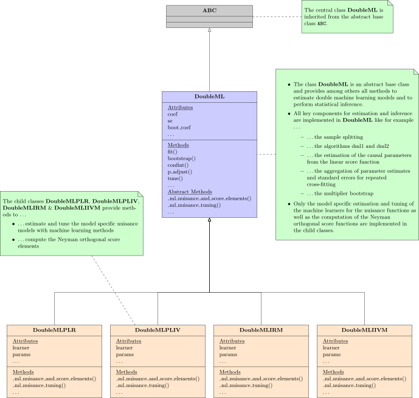

.. _doubleml_package:

DoubleML
========

.. |build| image:: https://github.com/DoubleML/doubleml-for-py/workflows/build/badge.svg
.. _build: https://github.com/DoubleML/doubleml-for-py/actions?query=workflow%3Abuild

.. |PyPi| image:: https://badge.fury.io/py/DoubleML.svg
.. _PyPi: https://badge.fury.io/py/DoubleML

.. |PythonVersion| image:: https://img.shields.io/badge/python-3.9%20%7C%203.10%20%7C%203.11%20%7C%203.12-blue
.. _PythonVersion: https://www.python.org/

The Python and R package **DoubleML** provide an implementation of the double / debiased machine learning framework of
`Chernozhukov et al. (2018) <https://doi.org/10.1111/ectj.12097>`_.
The Python package is built on top of `scikit-learn <https://scikit-learn.org/>`_ (Pedregosa et al., 2011)
and the R package on top of `mlr3 <https://mlr3.mlr-org.com/>`_ and the `mlr3
ecosystem <https://github.com/mlr-org/mlr3/wiki/Extension-Packages>`_ (Lang et al., 2019).

.. raw:: html

    

.. grid:: 2

    .. grid-item-card::
        :columns: 4
        :img-top: _static/light_gettingstarted.png
        :class-img-top: p-5 panel-icon
        :link: intro
        :link-type: ref
        :text-align: center
        :class-header: sd-font-weight-bold h4

        Getting started
        ^^^

        New to **DoubleML**? Then check out how to get started!

    .. grid-item-card::
        :columns: 4
        :img-top: _static/light_workflow.png
        :class-img-top: p-5 panel-icon
        :link: workflow
        :link-type: ref
        :text-align: center
        :class-header: sd-font-weight-bold h4

        Workflow
        ^^^

        The **DoubleML** workflow demonstrates the typical steps to consider when using **DoubleML** in applied analysis.

    .. grid-item-card::
        :columns: 4
        :img-top: _static/light_userguide.png
        :class-img-top: p-5 panel-icon
        :link: guide
        :link-type: ref
        :text-align: center
        :class-header: sd-font-weight-bold h4

        User guide
        ^^^

        Want to learn everything about **DoubleML**? Then you should visit our extensive user guide with detailed explanations and further references.

.. grid:: 2 3 3 2

    .. grid-item-card:: 
        :columns: 4
        :img-top: _static/light_pythonapi.png
        :class-img-top: p-5 panel-icon
        :link: python_api
        :link-type: ref
        :text-align: center
        :class-header: sd-font-weight-bold h4

        Python API
        ^^^

        The Python API documentation.

    .. grid-item-card:: 
        :columns: 4
        :img-top: _static/light_rapi.png
        :class-img-top: p-5 panel-icon
        :link: https://docs.doubleml.org/r/stable/
        :text-align: center
        :class-header: sd-font-weight-bold h4

        R API
        ^^^

        The R API documentation.

    .. grid-item-card::
        :columns: 4
        :img-top: _static/light_examplegallery.png
        :class-img-top: p-5 panel-icon
        :link: examplegallery
        :link-type: ref
        :text-align: center
        :class-header: sd-font-weight-bold h4

        Example gallery
        ^^^

        A gallery with examples demonstrating the functionalities of **DoubleML**.

.. toctree::
   :hidden:

    Install <intro/install>
    Getting Started <intro/intro>
    Workflow <workflow/workflow>
    User Guide <guide/guide>
    Examples <examples/index>
    Python API <api/api>
    R API <https://docs.doubleml.org/r/stable/>
    Coverage Repository <https://docs.doubleml.org/doubleml-coverage/>
    Literature <literature/literature>
    Release notes <release/release>

Double Machine Learning Algorithm
---------------------------------

.. raw:: html

    

        <iframe width="500" height="400" src="https://www.youtube.com/embed/NWEoLe8mZqM?si=qJxpUOJb2ROqNogY" title="Cross-Fitting Animation" frameborder="0" allowfullscreen></iframe>
    

Main Features
-------------

Double / debiased machine learning `Chernozhukov et al. (2018) <https://doi.org/10.1111/ectj.12097>`_ for

- Partially linear regression models (PLR)
- Partially linear IV regression models (PLIV)
- Interactive regression models (IRM)
- Interactive IV regression models (IIVM)

The object-oriented implementation of DoubleML is very flexible.
The model classes `DoubleMLPLR`, `DoubleMLPLIV`, `DoubleMLIRM` and `DoubleIIVM` implement the estimation of the nuisance
functions via machine learning methods and the computation of the Neyman orthogonal score function.
All other functionalities are implemented in the abstract base class `DoubleML`.
In particular functionalities to estimate double machine learning models and to perform statistical inference via the
methods `fit`, `bootstrap`, `confint`, `p_adjust` and `tune`.
This object-oriented implementation allows a high flexibility for the model specification in terms of ...

- ... the machine learning methods for estimation of the nuisance functions,
- ... the resampling schemes,
- ... the double machine learning algorithm,
- ... the Neyman orthogonal score functions,
- ...

It further can be readily extended with regards to

- ... new model classes that come with Neyman orthogonal score functions being linear in the target parameter,
- ... alternative score functions via callables,
- ... alternative resampling schemes,
- ...

Source code and maintenance
---------------------------

Documentation and website: `https://docs.doubleml.org/ <https://docs.doubleml.org/>`_

DoubleML is currently maintained by `@PhilippBach <https://github.com/PhilippBach>`_ and
`@SvenKlaassen <https://github.com/SvenKlaassen>`_.

The source code is available on GitHub: `Python source <https://github.com/DoubleML/doubleml-for-py>`_ and
`R source <https://github.com/DoubleML/doubleml-for-r>`_.

Bugs can be reported to the issue trackers:
`https://github.com/DoubleML/doubleml-for-py/issues <https://github.com/DoubleML/doubleml-for-py/issues>`_
and `https://github.com/DoubleML/doubleml-for-r/issues <https://github.com/DoubleML/doubleml-for-r/issues>`_.

Citation
--------

If you use the DoubleML package a citation is highly appreciated. To cite the Python package, please use the following reference:

Bach, P., Chernozhukov, V., Klaassen, S., Kurz, M. S., & Spindler, M. DoubleML - Double
Machine Learning in Python [Computer software]. `https://github.com/DoubleML/doubleml-for-py <https://github.com/DoubleML/doubleml-for-py>`_.

An accompanying paper to the DoubleML package for Python has been published in the Journal of Machine Learning Research. For citation, please use the following reference:

Bach, P., Chernozhukov, V., Kurz, M. S., and Spindler, M. (2022), DoubleML - An
Object-Oriented Implementation of Double Machine Learning in Python,
Journal of Machine Learning Research, 23(53): 1-6,
`https://www.jmlr.org/papers/v23/21-0862.html  <https://www.jmlr.org/papers/v23/21-0862.html>`_.

For the R package, please use the following reference:

Bach, P., Chernozhukov, V., Kurz, M. S., Spindler, M.  and Klaassen, S. (2024),
DoubleML - An Object-Oriented Implementation of Double Machine Learning in R, Journal of Statistical Software,
108(3): 1-56, doi:`10.18637/jss.v108.i03 <https://doi.org/10.18637/jss.v108.i03>`_, arXiv:`2103.09603 <https://arxiv.org/abs/2103.09603>`_.

Bibtex-entries:

.. code-block:: TeX

    @software{DoubleML,
      title    = {{DoubleML} -- Double Machine Learning in Python},
      author   = {Bach, Philipp and Chernozhukov, Victor and Klaassen, Sven and Kurz, Malte S. and Spindler, Martin},
      year     = {2024},
      version  = {latest},
      url      = {https://github.com/DoubleML/doubleml-for-py},
      note     = {BSD-3-Clause License. Documentation: \url{https://docs.doubleml.org/stable/index.html}}
    }

.. code-block:: TeX

    @article{DoubleML2022Python,
      title   = {{DoubleML} -- {A}n Object-Oriented Implementation of Double Machine Learning in {P}ython},
      author  = {Philipp Bach and Victor Chernozhukov and Malte S. Kurz and Martin Spindler},
      journal = {Journal of Machine Learning Research},
      year    = {2022},
      volume  = {23},
      number  = {53},
      pages   = {1--6},
      url     = {http://jmlr.org/papers/v23/21-0862.html}
    }

.. code-block:: TeX

    @Article{doubleml2024R,
      title   = {{DoubleML}: {A}n Object-Oriented Implementation of Double Machine Learning in {R}},
      author  = {Philipp Bach and Malte S. Kurz and Victor Chernozhukov and Martin Spindler and Sven Klaassen},
      journal = {Journal of Statistical Software},
      year    = {2024},
      volume  = {108},
      number  = {3},
      pages   = {1--56},
      doi     = {10.18637/jss.v108.i03},
      note={arXiv:\href{https://arxiv.org/abs/2103.09603}{2103.09603} [stat.ML]}
    }

Acknowledgements
----------------

Funding by the Deutsche Forschungsgemeinschaft (DFG, German Research
Foundation) is acknowledged – Project Number 431701914.

References
----------

Bach, P., Chernozhukov, V., Kurz, M. S., and Spindler, M. (2022), DoubleML - An
Object-Oriented Implementation of Double Machine Learning in Python,
Journal of Machine Learning Research, 23(53): 1-6,
`https://www.jmlr.org/papers/v23/21-0862.html  <https://www.jmlr.org/papers/v23/21-0862.html>`_.

Bach, P., Chernozhukov, V., Kurz, M. S., Spindler, M. and Klaassen, S. (2024),
DoubleML - An Object-Oriented Implementation of Double Machine Learning in R, Journal of Statistical Software,
108(3): 1-56, doi:`10.18637/jss.v108.i03 <https://doi.org/10.18637/jss.v108.i03>`_, arXiv:`2103.09603 <https://arxiv.org/abs/2103.09603>`_.

Chernozhukov, V., Chetverikov, D., Demirer, M., Duflo, E., Hansen, C., Newey, W. and Robins, J. (2018),
Double/debiased machine learning for treatment and structural parameters. The Econometrics Journal, 21: C1-C68, doi:`10.1111/ectj.12097 <https://doi.org/10.1111/ectj.12097>`_.

Lang, M., Binder, M., Richter, J., Schratz, P., Pfisterer, F., Coors, S., Au, Q., Casalicchio, G., Kotthoff, L. and Bischl, B. (2019),
mlr3: A modern object-oriented machine learing framework in R. Journal of Open Source Software, doi:`10.21105/joss.01903 <https://doi.org/10.21105/joss.01903>`_.

Pedregosa, F., Varoquaux, G., Gramfort, A., Michel, V., Thirion, B., Grisel, O., Blondel, M., Prettenhofer, P., Weiss, R., Dubourg, V., Vanderplas, J., Passos, A., Cournapeau, D., Brucher, M., Perrot, M. and Duchesnay, E. (2011),
Scikit-learn: Machine Learning in Python. Journal of Machine Learning Research, 12: 2825--2830, `https://jmlr.csail.mit.edu/papers/v12/pedregosa11a.html <https://jmlr.csail.mit.edu/papers/v12/pedregosa11a.html>`_.
