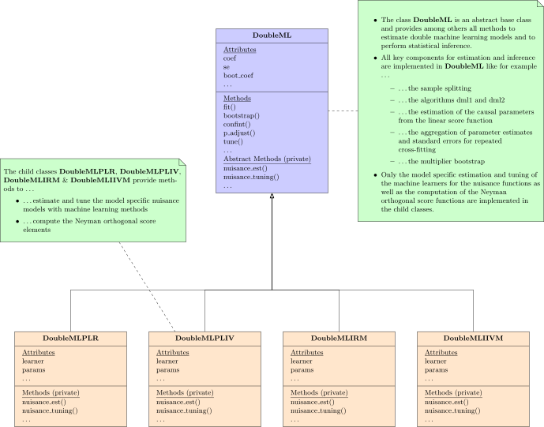

.. _doubleml_package:

DoubleML
========

.. |build| image:: https://github.com/DoubleML/doubleml-for-py/workflows/build/badge.svg
.. _build: https://github.com/DoubleML/doubleml-for-py/actions?query=workflow%3Abuild

.. |PyPi| image:: https://badge.fury.io/py/DoubleML.svg
.. _PyPi: https://badge.fury.io/py/DoubleML

.. |PythonVersion| image:: https://img.shields.io/badge/python-3.6%20%7C%203.7%20%7C%203.8%20%7C%203.9-blue
.. _PythonVersion: https://www.python.org/

The Python and R package **DoubleML** provide an implementation of the double / debiased machine learning framework of
`Chernozhukov et al. (2018) <https://doi.org/10.1111/ectj.12097>`_.
The Python package is built on top of `scikit-learn <https://scikit-learn.org/>`_ (Pedregosa et al., 2011)
and the R package on top of `mlr3 <https://mlr3.mlr-org.com/>`_ and the `mlr3
ecosystem <https://github.com/mlr-org/mlr3/wiki/Extension-Packages>`_ (Lang et al., 2019).

Contents
--------

.. panels::

    .. link-button:: intro/install
        :type: ref
        :text: Install
        :classes: btn-outline-primary btn-block
    ---
    .. link-button:: intro/intro
        :type: ref
        :text: Getting started
        :classes: btn-outline-primary btn-block
    ---
    .. link-button:: api/api
        :type: ref
        :text: Python API
        :classes: btn-outline-primary btn-block
    ---
    .. link-button:: https://docs.doubleml.org/r/stable/
        :type: url
        :text: R API
        :classes: btn-outline-primary btn-block

.. dropdown:: User guide
    :title: bg-white text-primary text-center font-weight-bold

    .. panels::
        :column: col-lg-12

        ---
        .. link-button:: guide/basics
            :type: ref
            :text: 1. The basics of double/debiased machine learning
            :classes: btn-outline-primary btn-block
        ---
        .. link-button:: guide/data_backend
            :type: ref
            :text: 2. The data-backend DoubleMLData
            :classes: btn-outline-primary btn-block
        ---
        .. link-button:: guide/models
            :type: ref
            :text: 3. Models
            :classes: btn-outline-primary btn-block
        ---
        .. link-button:: guide/scores
            :type: ref
            :text: 4. Score functions
            :classes: btn-outline-primary btn-block
        ---
        .. link-button:: guide/algorithms
            :type: ref
            :text: 5. Double machine learning algorithms
            :classes: btn-outline-primary btn-block
        ---
        .. link-button:: guide/learners
            :type: ref
            :text: 6. Learners, hyperparameters and hyperparameter tuning
            :classes: btn-outline-primary btn-block
        ---
        .. link-button:: guide/se_confint
            :type: ref
            :text: 7. Variance estimation and confidence intervals for a causal parameter of interest
            :classes: btn-outline-primary btn-block
        ---
        .. link-button:: guide/sim_inf
            :type: ref
            :text: 8. Confidence bands and multiplier bootstrap for valid simultaneous inference
            :classes: btn-outline-primary btn-block
        ---
        .. link-button:: guide/resampling
            :type: ref
            :text: 9. Sample-splitting, cross-fitting and repeated cross-fitting
            :classes: btn-outline-primary btn-block

.. toctree::
   :hidden:

   self

.. toctree::
   :hidden:

    Install <intro/install>
    Getting started <intro/intro>
    User guide <guide/guide>
    Examples <auto_examples/index>
    Python API <api/api>
    R API <https://docs.doubleml.org/r/stable/>
    Release notes <release/release>

Main Features
-------------

Double / debiased machine learning `Chernozhukov et al. (2018) <https://doi.org/10.1111/ectj.12097>`_ for

- Partially linear regression models (PLR)
- Partially linear IV regression models (PLIV)
- Interactive regression models (IRM)
- Interactive IV regression models (IIVM)

The object-oriented implementation of DoubleML is very flexible.
The model classes `DoubleMLPLR`, `DoubleMLPLIV`, `DoubleMLIRM` and `DoubleIIVM` implement the estimation of the nuisance
functions via machine learning methods and the computation of the Neyman orthogonal score function.
All other functionalities are implemented in the abstract base class `DoubleML`.
In particular functionalities to estimate double machine learning models and to perform statistical inference via the
methods `fit`, `bootstrap`, `confint`, `p_adjust` and `tune`.
This object-oriented implementation allows a high flexibility for the model specification in terms of ...

- ... the machine learning methods for estimation of the nuisance functions,
- ... the resampling schemes,
- ... the double machine learning algorithm,
- ... the Neyman orthogonal score functions,
- ...

It further can be readily extended with regards to

- ... new model classes that come with Neyman orthogonal score functions being linear in the target parameter,
- ... alternative score functions via callables,
- ... alternative resampling schemes,
- ...

Source code and maintenance
---------------------------

Documentation and website: `https://docs.doubleml.org/ <https://docs.doubleml.org/>`_

DoubleML is currently maintained by
`@MalteKurz <https://github.com/MalteKurz>`_ and
`@PhilippBach <https://github.com/PhilippBach>`_.

The source code is available on GitHub: `Python source <https://github.com/DoubleML/doubleml-for-py>`_ and
`R source <https://github.com/DoubleML/doubleml-for-r>`_.

Bugs can be reported to the issue trackers:
`https://github.com/DoubleML/doubleml-for-py/issues <https://github.com/DoubleML/doubleml-for-py/issues>`_
and `https://github.com/DoubleML/doubleml-for-r/issues <https://github.com/DoubleML/doubleml-for-r/issues>`_.

Citation
--------

If you use the DoubleML package a citation is highly appreciated:

Bach, P., Chernozhukov, V., Kurz, M. S., and Spindler, M. (2021),
DoubleML - An Object-Oriented Implementation of Double Machine Learning in Python,
arXiv:`2104.03220 <https://arxiv.org/abs/2104.03220>`_.

Bach, P., Chernozhukov, V., Kurz, M. S., and Spindler, M. (2021),
DoubleML - An Object-Oriented Implementation of Double Machine Learning in R,
arXiv:`2103.09603 <https://arxiv.org/abs/2103.09603>`_.

Bibtex-entries:

.. code-block:: TeX

    @misc{DoubleML2021Python,
      title={{DoubleML} -- {A}n Object-Oriented Implementation of Double Machine Learning in {P}ython},
      author={Philipp Bach and Victor Chernozhukov and Malte S. Kurz and Martin Spindler},
      year={2021},
      eprint={2104.03220},
      archivePrefix={arXiv},
      primaryClass={stat.ML},
      note={arXiv:\href{https://arxiv.org/abs/2104.03220}{2104.03220} [stat.ML]}
    }

.. code-block:: TeX

    @misc{DoubleML2021R,
      title={{DoubleML} -- {A}n Object-Oriented Implementation of Double Machine Learning in {R}},
      author={P. Bach and V. Chernozhukov and M. S. Kurz and M. Spindler},
      year={2021},
      eprint={2103.09603},
      archivePrefix={arXiv},
      primaryClass={stat.ML},
      note={arXiv:\href{https://arxiv.org/abs/2103.09603}{2103.09603} [stat.ML]}
    }

References
----------

Chernozhukov, V., Chetverikov, D., Demirer, M., Duflo, E., Hansen, C., Newey, W. and Robins, J. (2018),
Double/debiased machine learning for treatment and structural parameters. The Econometrics Journal, 21: C1-C68, doi:`10.1111/ectj.12097 <https://doi.org/10.1111/ectj.12097>`_.

Lang, M., Binder, M., Richter, J., Schratz, P., Pfisterer, F., Coors, S., Au, Q., Casalicchio, G., Kotthoff, L. and Bischl, B. (2019),
mlr3: A modern object-oriented machine learing framework in R. Journal of Open Source Software, doi:`10.21105/joss.01903 <https://10.21105/joss.01903>`_.

Pedregosa, F., Varoquaux, G., Gramfort, A., Michel, V., Thirion, B., Grisel, O., Blondel, M., Prettenhofer, P., Weiss, R., Dubourg, V., Vanderplas, J., Passos, A., Cournapeau, D., Brucher, M., Perrot, M. and Duchesnay, E. (2011),
Scikit-learn: Machine Learning in Python. Journal of Machine Learning Research, 12: 2825--2830, `https://jmlr.csail.mit.edu/papers/v12/pedregosa11a.html <https://jmlr.csail.mit.edu/papers/v12/pedregosa11a.html>`_.
