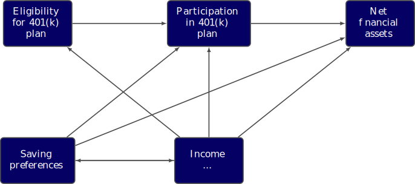

:parenttoc: True

DoubleML Workflow
=================

TODO: Format: Highlight of General vs. Example-Specific Part
TODO: Check & polish formulations
TODO: Run and polish format in code blocks

The following steps, which we call the DoubleML workflow, are intended to provide a rough structure for causal analyses
with the :ref:`DoubleML <doubleml_package>`. After a short explanation of the idea of each step, we illustrate their meaning in the 401(k)
example. In case you are interested in more details of the 401(k) example, you can visit the 
`Python <https://docs.doubleml.org/stable/examples/py_double_ml_pension.html>`_ and `R <https://docs.doubleml.org/stable/examples/R_double_ml_pension.html>`_
Notebooks that are available online.

0. Problem Formulation
----------------------

The initial step of the DoubleML workflow is to formulate the causal problem at hand. Before we start our statistical
analysis, we have to explicitly state the conditions required for a causal interpretation of the estimator, which will
be computed later. In many cases, directed acyclical graphs (DAGs) are helpful to formulate the causal problem,
illustrate the involved causal channels and the critical parts of the inferential framework. At this stage, a precise
argumentation and discussion of the research question is crucial.

In the 401(k) study, we are interested in estimating the average treatment effect of participation in so-called 401(k) pension
plans on employees' net financial assets. Because we cannot rely on a properly conducted randomized control study in this
example, we have to base our analysis on observational data. Hence, we have to use an identification strategy that is based
on appropriately controlling for potential confounders.
A complication that arises in the 401(k) example is due to so-called endogeneity of the treatment assignment. The treatment
variable is an employee's participation in a 401(k) pension plan which is a decision made by employees and likely
to be affected by unobservable effects. For example, is seems reasonable that persons with higher income have a stronger
preference to save and also to participate in a pension plan. If our analysis does not account for this self-selection into
treatment, the estimated effect is likely to be biased.

To circumvent the endogenous treatment problem, it is possible to exploit randomness in eligibility for 401(k) plans.
In other words, the access to the treatment can be considered as randomly assigned once we control for confounding variables.
Earlier studies in this context argue that if characteristics that are related to saving preferences are taken into account,
eligibility can be considered as good as randomly assigned (at the time 401(k) plans were introduced).
The conditional exogeneity in the access to treatment makes it possible to estimate the causal effect of interest by using
an instrumental variable (IV) approach. However, for the sake of brevity, we will focus on the so-called intent-to-treat effect in the following.
This effect corresponds to the average treatment effect of eligibility (= the instrument) on net financial assets (= the outcome) and
is of great interest in many applications. The IV analysis is available in the `Python <https://docs.doubleml.org/stable/examples/py_double_ml_pension.html>`_
and `R <https://docs.doubleml.org/stable/examples/R_double_ml_pension.html>`_ Notebooks that are available online.

The previous discussion focuses on the causal problem. Let's also talk about the statistical methods used for estimation.
For identification of the average treatment effect of participation or eligibility on assets, it is crucial that we appropriately
account for the confounding factors. That's where the machine learning tools come into play. Of course, we could simply estimate
the causal effect by using a linear (IV) regression model. In these models, the researcher has to manually pick and, perhaps,
transform variables. However, machine learning techniques offer greater flexibility in terms of a more data-driven specification
of the main regression equation and the propensity score.

1. Data-Backend
---------------

In step 1., we initialize the data-backend and thereby declare the role of the outcome, the treatment, and the confounding variables.

We use data from the 1991 Survey of Income and Program Participation which is available via the function 
`fetch_401K (Python)<https://docs.doubleml.org/stable/api/generated/doubleml.datasets.fetch_401K.html>`_
or `fetch_401k (R)<https://docs.doubleml.org/r/stable/reference/fetch_401k.html>`_.
The data-backend can be initialized from various data frame objects in Python and R. To estimate the intent-to-treat effect in the
401(k) example, we use eligibility (``e401``) as the treatment variable of interest. The outcome variable is ``net_tfa`` and we
control for confounding variables ``['age', 'inc', 'educ', 'fsize', 'marr', 'twoearn', 'db', 'pira', 'hown']``.

.. tabbed:: Python

    .. ipython:: python

        from doubleml import DoubleMLData
        from doubleml.datasets import fetch_401K
        data = fetch_401K(return_type='DataFrame')
        # Construct DoubleMLData object
        dml_data = DoubleMLData(data, y_col='net_tfa', d_cols='e401',
                                x_cols=['age', 'inc', 'educ', 'fsize', 'marr',
                                        'twoearn', 'db', 'pira', 'hown'])

.. tabbed:: R

    .. jupyter-execute::

        library(DoubleML)
        data = fetch_401k(return_type='data.table')
        # Construct DoubleMLData object from data.table
        dml_data = DoubleMLData$new(data, y_col='net_tfa', d_cols='e401',
                                x_cols=c('age', 'inc', 'educ', 'fsize',
                                         'marr', 'twoearn', 'db', 'pira',
                                         'hown'))

        data_frame = fetch_401k(return_type='data.frame')
        # Construct DoubleMLData object from data.frame
        dml_data_df = double_ml_data_from_data_frame(data_frame,
                                                     y_col='net_tfa',
                                                     d_cols='e401',
                                                     x_cols=c('age', 'inc',
                                                              'educ', 'fsize',
                                                              'marr', 'twoearn',
                                                              'db', 'pira',
                                                              'hown'))

2. Causal Model
---------------

In Step 2. we choose a causal model. There are several models currently implemented in :ref:`DoubleML <doubleml_package>` which
differ in terms of the underlying causal structure (e.g., including IV variables or not) and the underlying assumptions.

[TODO]: Include Figure with causal models

According to the previous discussion, we are interested in estimation of the effect of eligibility on net financial assets.
Hence, we do not need to use a model with both a treatment and instrumental variable. There are two potential models,
the :ref:`partially linear regression model (PLR) <plr-model>` and the :ref:`interactive regression model (IRM) <irm-model>`. These models differ
in terms of the type of the treatment variable (continuous vs. binary treatment) and the assumptions underlying the regression
equation. For example, the PLR assumes a partially linear structure, whereas the IRM allows for heterogeneous treatment effects across
individuals.

In Step 2. we can precisely discuss the identification strategy using a DAG.

[TODO]: prepare DAG Figure and include together with caption

3. ML Methods
-------------

In Step 3. we can specify the machine learning tools used for estimation of the nuisance parts.
We can generally choose any learner from `scikit learn <https://scikit-learn.org>`_ in Python and from the `mlr3 <https://mlr3.mlr-org.com>`_ ecosystem in R.

There are two nuisance parts in the PLR, :math:`g_0(X)=\mathbb{E}(Y|X)` and  :math:`m_0(X)=\mathbb{E}(D|X)`.
In this example, let us specify a random forest and an xgboost learner for both prediction problems.
We can directly pass the parameters during initialization of the learner objects.
Because we have a binary treatment variable, we can use a classification learner for the corresponding nuisance part.
We use a regression learner for the outcome variable net financial assets.

.. tabbed:: Python

    .. ipython:: python

        # Random forest learners
        from sklearn.ensemble import RandomForestClassifier, RandomForestRegressor
        ml_g_rf = RandomForestRegressor(n_estimators = 500, max_depth = 7,
                                        max_features = 3, min_samples_leaf = 3)
        ml_m_rf = RandomForestClassifier(n_estimators = 500, max_depth = 5,
                                        max_features = 4, min_samples_leaf = 7)

        # Xgboost learners
        from xgboost import XGBClassifier, XGBRegressor
        ml_g_xgb = XGBRegressor(objective = "reg:squarederror", eta = 0.1,
                                n_estimators =35)
        ml_m_xgb = XGBClassifier(use_label_encoder = False ,
                                objective = "binary:logistic",
                                eval_metric = "logloss",
                                eta = 0.1, n_estimators = 34)

.. tabbed:: R

    .. jupyter-execute::

        library(mlr3)
        library(mlr3learners)
        # Random forest learners
        ml_g_rf = lrn("regr.ranger", max.depth = 7,
                    mtry = 3, min.node.size =3)
        ml_m_rf = lrn("classif.ranger", max.depth = 5,
                    mtry = 4, min.node.size = 7)

        # Xgboost learners
        ml_g_xgb = lrn("regr.xgboost", objective = "reg:squarederror",
                        eta = 0.1, nrounds = 35)
        ml_m_xgb = lrn("classif.xgboost", objective = "binary:logistic",
                        eval_metric = "logloss",
                        eta = 0.1, nrounds = 34)

4. DML Specifications
---------------------

In Step 4., we initialize and parametrize the model object which will later be used to perform the estimation.

We initialize a `DoubleMLPLR (Python)<https://docs.doubleml.org/stable/api/generated/doubleml.DoubleMLPLR.html>`_ /
`DoubleMLPLR (R)<https://docs.doubleml.org/r/stable/reference/DoubleMLPLR.html>`_
using the previously generated data-backend. Moreover, we specify the resampling
(= the number of repetitions and folds for :ref:`repeated cross-fitting <repeated-cross-fitting>`),
the dml algorithm (:ref:`DML1 vs. DML2 <algorithms>`) and the score function (:ref:`"partialling out" or
"IV-type" <plr-score>`).

.. tabbed:: Python

    .. ipython:: python

        from doubleml import DoubleMLPLR
        np.random.seed(123)
        # Default values
        dml_plr_tree = DoubleMLPLR(dml_data,
                                    ml_g = ml_g_rf,
                                    ml_m = ml_m_rf)

        np.random.seed(123)
        # Parametrized by user
        dml_plr_tree = DoubleMLPLR(dml_data,
                                    ml_g = ml_g_rf,
                                    ml_m = ml_m_rf,
                                    n_folds = 3,
                                    n_rep = 1,
                                    score = 'partialling out',
                                    dml_procedure = 'dml2')

.. tabbed:: R

    .. jupyter-execute::

        set.seed(123)
        # Default values
        dml_plr_forest = DoubleMLPLR$new(dml_data,
                                        ml_g = ml_g_rf,
                                        ml_m = ml_m_rf)

        set.seed(123)
        # Parametrized by user
        dml_plr_forest = DoubleMLPLR$new(dml_data,
                                        ml_g = ml_g_rf,
                                        ml_m = ml_m_rf,
                                        n_folds = 3,
                                        score = 'partialling out',
                                        dml_procedure = 'dml2')

5. Estimation
-------------

We perform estimation in Step 5. In this step, the cross-fitting algorithm is executed such that the predictions
in the score are computed. As an output, users can access the coefficient estimates and standard errors either via the
corresponding fields or via a summary.

.. tabbed:: Python

    .. ipython:: python

        # Estimation
        dml_plr_tree.fit()

        # Coefficient estimate
        dml_plr_tree.coef

        # Stndard error
        dml_plr_tree.se

        # Summary
        dml_plr_tree.summary

.. tabbed:: R

    .. jupyter-execute::

        # Estimation
        dml_plr_forest$fit()

        # Coefficient estimate
        dml_plr_forest$coef

        # Stndard error
        dml_plr_forest$se

        # Summary
        dml_plr_forest$summary()

6. Inference
------------

In Step 6. we can perform further inference methods and finally interpret our findings. For example, we can set up confidence intervals
or, in case multiple causal parameters are estimated, adjust the analysis for multiple testing. :ref:`DoubleML <doubleml_package>`
supports various approaches to perform :ref:`valid simultaneous inference <sim_inf>`
which are partly based on a multiplier bootstrap.

To conclude analysis on the average treatment effect of eligibility for 401(k) pension plans on net financial assets, we find a
positive and significant effect: Being eligible for such a pension plan increases the amount of net financial assets by
approximately :math:`$9,000`. This estimate is much smaller than the unconditional effect of elegibility on net financial assets:
If we did not control for the confounding variables, the average treatment effect would correspond to :math:`$19,559`.

.. tabbed:: Python

    .. ipython:: python

        # Summary
        dml_plr_tree.summary

        # Confidence intervals
        dml_plr_tree.confint()

        # Multiplier bootstrap (relevant in case with multiple treatment variables)
        dml_plr_tree.bootstrap()

        # Simultaneous confidence bands
        dml_plr_tree.confint(joint = True)

.. tabbed:: R

    .. jupyter-execute::

        # Summary
        dml_plr_forest$summary()

        # Confidence intervals
        dml_plr_forest$confint()

        # Multiplier bootstrap (relevant in case with multiple treatment variables)
        dml_plr_forest$bootstrap()

        # Simultaneous confidence bands
        dml_plr_forest$confint(joint = TRUE)